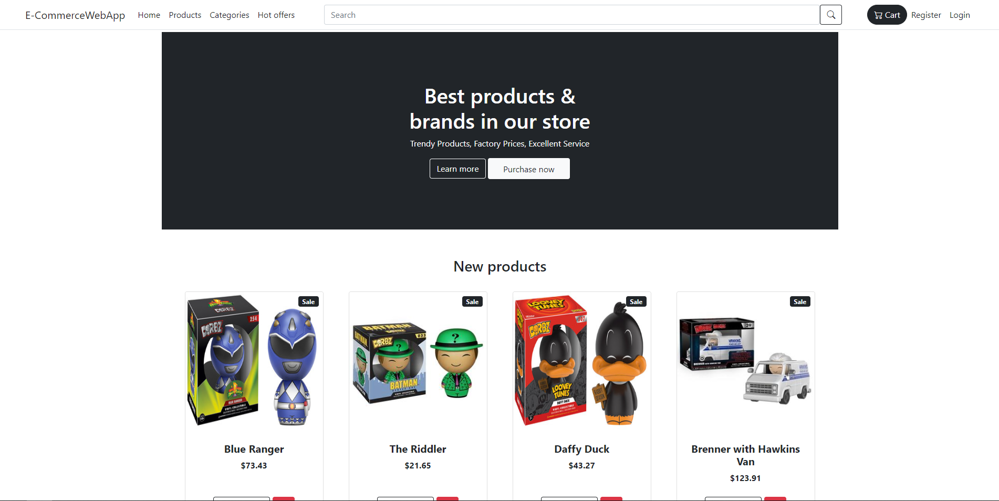

# E-Commerce Website 🛒

Online store solution to sell my Funko Pops 😎, 🎉 Using Asp.net MVC and Razor. The cool part? It's a work in progress, always getting better with new features.
Feel free to check out this documentation or live development on Azure.

## Quick start

For a quick start, you can check out the website on Azure [here](https://e-commercewebapp20231231132835.azurewebsites.net/) or scroll to the Getting Started section for more information on how to clone the project locally.

## Table of Contents

-   [Introduction](#introduction)
-   [Motivation](#motivation)
-   [Technologies](#technologies)
-   [Features](#features)
    -   [Future features](#future-features)
-   [Getting Started](#getting-started)
    -   [Prerequisites](#prerequisites)
    -   [Installation](#installation)
-   [Project walkthrough](#project-walkthrough)
-   [Contributing](#contributing)
    -   [Suggesting ideas](#suggesting-ideas)
    -   [How to Contribute](#how-to-contribute)
    -   [Reporting Bugs](#reporting-bugs)

## Introduction

This is a full-stack online store solution where users can browse products with pagination. Users can create accounts or log in using external providers like Google. They can easily add products to their cart, proceed to checkout online, and place their orders.

Used Identity for handling security, Entity Framework to manage database access and Nunit for unit testing, The solution is deployed on Azure.

## Motivation

This open-source project aims to provide small business owners with a quick start for their online store, with easy adaptation to their specific needs.

## Technologies

<a href="https://skillicons.dev">

</a>

Additional used

-   Identity, Entity Framework, MS SQL Server, Nunit

## Features [🔼](#table-of-contents)

-   Browse products with pagination
-   Secure admin management panel to manage products and categories
-   Support for creating accounts
-   Integration with external login providers like Google

### Future features (In progress)[🔼](#table-of-contents)

    - Integration with payment providers like Stripe
    - Support for wishlist
    - Product Reviews and Ratings
    - Order History
    - Inventory Management
    - Reporting and Analytics

## Getting Started [🔼](#table-of-contents)

### Prerequisites

    - Dotnet runtime - 6.0
    - Visual studio - 19 or 22

### Installation

Steps to install and run this project locally

-   Step 1 clone project in terminal paste:

    ```bash
    git clone https://github.com/ahmads1990/E-CommerceWebApp
    ```

-   Step 2 setup configuration for for database access and login provider in following this format

    ```json
    {
        "ConnectionStrings": {
            "DefaultConnection": "Your connection string"
        },
        "EmailServerSettings": {
            "Host": "hostname",
            "Port": port,
            "SenderEmail": "main",
            "SenderName": "Storename",
            "Username": "username",
            "Password": "secret"
        }
    }
    ```

-   Step 3 go to prokect and restore packages using

    ```bash
    cd ./"project path"
    dotnet restore
    ```

## Project walkthrough [🔼](#table-of-contents)



## Contributing [🔼](#table-of-contents)

Thank you for considering contributing to my project! Whether it's reporting issues, submitting bug fixes, or proposing new features, your contributions are welcome and appreciated.

### Suggesting ideas [🔼](#table-of-contents)

We welcome suggestions for new features or improvements. Please open an issue to discuss your ideas before starting to work on them or send me a email.

### How to Contribute [🔼](#table-of-contents)

1. Fork the repository to your GitHub account.
2. Checkout installation section
3. Create a new branch for your contribution:

    ```bash
    git checkout -b feature-branch
    ```

4. Make your changes and commit them with a descriptive commit message:

    ```bash
    git commit -m "Add your descriptive message here"
    ```

5. Push the changes to your forked repository:

    ```bash
    git push origin feature-branch
    ```

6. Open a pull request on the original repository. Provide a clear title and description for your pull request, explaining the changes you made.

### Reporting Bugs [🔼](#table-of-contents)

If you find a bug, please open an issue and provide detailed information, including:

-   Steps to reproduce the bug
-   Expected behavior
-   Actual behavior
-   Screenshot (optional)
-   Environment details (e.g., operating system, browser, etc.)

Thank you for contributing!
